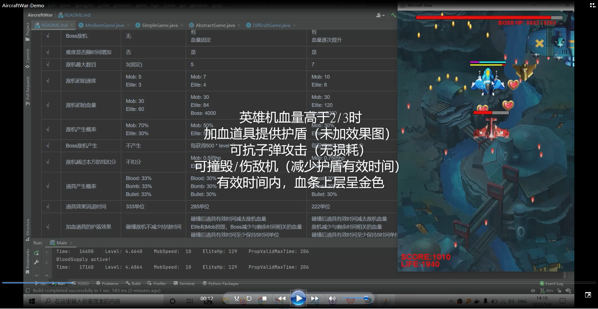

# Aircraft War

## Content

- `docs`

  - `archive`

    存档实验作业和课件，以及部分未完成`Todo`

  - `assets`

  - `handout`

    实践阶段（安卓开发）的课件

  - `submit`

    实践阶段（安卓开发）需要上传的任务

- `lib`

- `src`

- `test`

  本部分为测试代码，使用`JUnit5`

- `uml`

  本目录下存放有各次实验绘制的uml文件及导出png图片，是`lab-submit`部分的子集

## Description

结果演示：

## Note

* DAO模式，因为添加了gson作为数据操作的包，如果无法直接运行，需要添加lib/gson/目录下的jar包到Project Structure的依赖中
* 运行游戏，可以双击`AircraftWar.jar`或者使用命令行`java -jar AircraftWar.jar`运行
