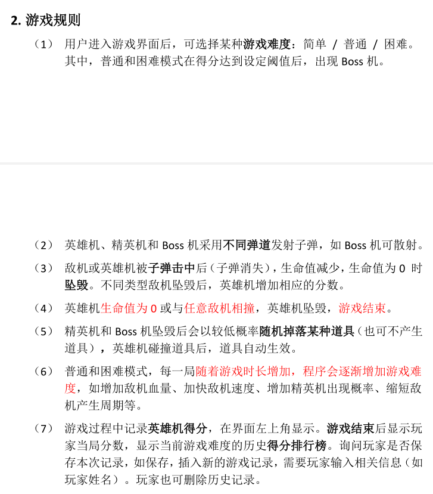

# Aircraft War

## Tutorial

- [ ] Java小游戏开发逻辑 https://zhuanlan.zhihu.com/p/59600990 
- [ ] 控制台窗口设计

## Game Setting

## Commit

### feat:

lab 1

- [x] 每隔一定周期随机产生一架普通敌机或精英敌机
- [ ] 精英敌机按设定周期发射子弹
- [ ] 精英敌机坠毁后随机产生某种道具（或不产生道具）
- [ ] 英雄机碰撞道具后，道具自动生效，其中加血道具生效时可使英雄机恢复一
  定血量，火力道具和炸弹道具无需具体实现，生效时只需打印“FireSupply
  active!”“BombSupply active!”语句即可。

---

- [ ] 火力道具和炸弹道具生效

- [ ] 查找爆炸动画图片，用作击毁敌机或者自己坠毁的特效
- [ ] 碰撞检测，范围控制到合理的位置
- [ ] 设置所有属性的setter和getter，方便调试，预留控制台窗口触发事件
- [ ] 增加道具：
  * 护盾道具，碰撞敌机坠毁
- [ ] 普通敌机血量添加（根据敌军血量来决定敌军坠毁）

- [ ] 敌机通过屏幕下方扣除分数，分数扣除取决于敌军血量和类别
- [ ] 敌军血条，血条图片和替换图片

### bug:

- [ ] 鼠标拖拽可以导致瞬移，似乎是直接使用拖拽的必然bug，需要重新考虑拖拽的实现方式
- [ ] 刷新频率与子弹、敌机产生速度绑定，慢速模式下存在卡顿

